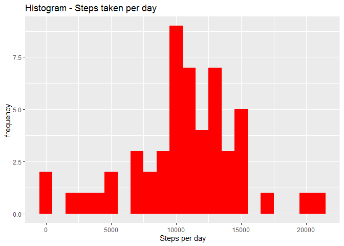
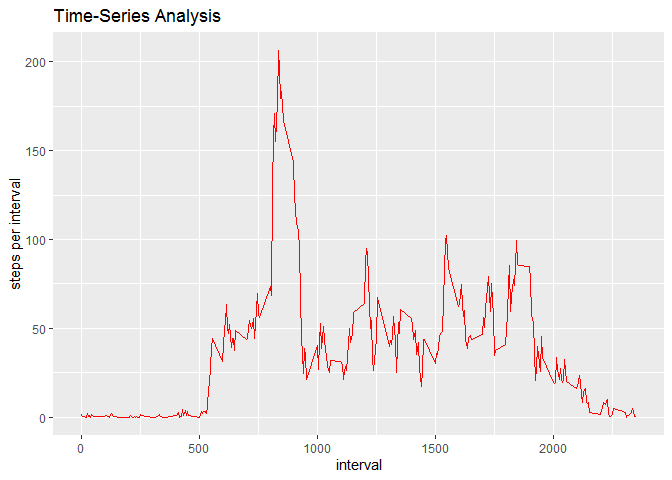
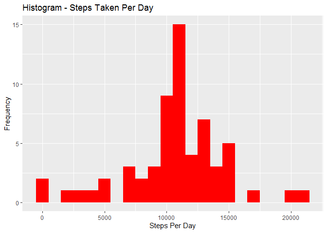
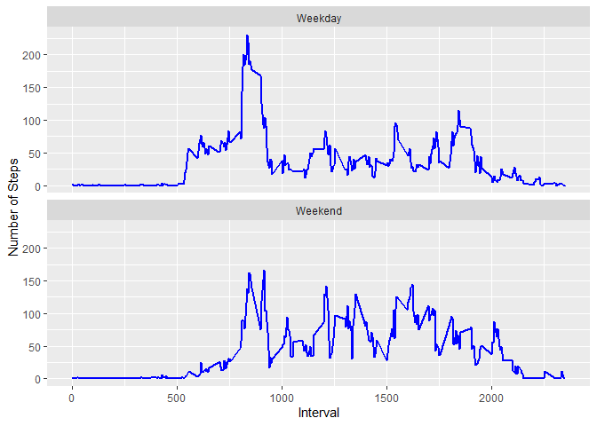

## Loading and preprocessing the data

```r
library(knitr)
```

```
## Warning: package 'knitr' was built under R version 3.6.3
```

```r
library(ggplot2)
library(data.table)
```

```
## Warning: package 'data.table' was built under R version 3.6.2
```

```r
opts_chunk$set(echo = TRUE, results = 'hold')
setwd('J:/Jishnu')
activity <- read.csv('activity.csv', header = T, sep = ',')
activity$date <- as.Date(activity$date, format='%Y-%m-%d')
activity$interval <- as.factor(activity$interval)
```

## What is mean total number of steps taken per day?

```r
steps_per_day <- aggregate(steps~date, data=activity, FUN=sum)
colnames(steps_per_day) <- c('date','steps')
```

```r
head(steps_per_day)
```

```
##         date steps
## 1 2012-10-02   126
## 2 2012-10-03 11352
## 3 2012-10-04 12116
## 4 2012-10-05 13294
## 5 2012-10-06 15420
## 6 2012-10-07 11015
```


```r
ggplot(steps_per_day, aes(x=steps)) + geom_histogram(fill = 'red', binwidth=1000) + labs(title = 'Histogram - Steps taken per day', x = 'Steps per day', y = 'frequency')
```




```r
mean_steps_per_day <- mean(steps_per_day$steps)
mean_steps_per_day
```

```
## [1] 10766.19
```

```r
median_steps_per_day <- median(steps_per_day$steps)
median_steps_per_day
```

```
## [1] 10765
```


## What is the average daily activity pattern?


```r
steps_interval <- aggregate(steps~interval, data=activity, FUN=mean, nar.rm=T)
steps_interval$interval <- as.integer(levels(steps_interval$interval)[steps_interval$interval])
colnames(steps_interval) <- c('interval', 'steps')
```

```r
head(steps_interval, 10)
```

```
##    interval     steps
## 1         0 1.7169811
## 2         5 0.3396226
## 3        10 0.1320755
## 4        15 0.1509434
## 5        20 0.0754717
## 6        25 2.0943396
## 7        30 0.5283019
## 8        35 0.8679245
## 9        40 0.0000000
## 10       45 1.4716981
```

```r
ggplot(data=steps_interval, aes(x=interval, y=steps)) + geom_line(col='red', lwd = 0.2) + labs(title='Time-Series Analysis', x='interval', y='steps per interval')
```



## Imputing missing values


```r
max_steps_interval <- steps_interval[which.max(steps_interval$steps),]
max_steps_interval
```

```
##     interval    steps
## 104      835 206.1698
```

```r
missing_values <- sum(is.na(activity))
missing_values
```

```
## [1] 2304
```

```r
new_activity <- activity
index_activity <- which(is.na(new_activity))
for (i in index_activity) {
new_activity$steps[i] <- with(steps_interval, steps[interval = new_activity$interval[i]])
} 
```

```r
table(is.na(new_activity))
```

```
## 
## FALSE 
## 52704
```

```r
new_steps_per_day <- aggregate(steps~date, data=new_activity, FUN=sum)
colnames(new_steps_per_day) <- c('date','steps')
```

```r
ggplot(new_steps_per_day, aes(x = steps)) + 
  geom_histogram(fill = "red", binwidth = 1000) + 
  labs(title = "Histogram - Steps Taken Per Day", x = "Steps Per Day", y = "Frequency")
```



```r
new_mean_steps_per_day <- mean(steps_per_day$steps)
new_mean_steps_per_day
```

```
## [1] 10766.19
```

```r
new_median_steps_per_day <- median(steps_per_day$steps)
new_median_steps_per_day
```

```
## [1] 10765
```

## Are there differences in activity patterns between weekdays and weekends?


```r
data <- data.table(new_activity)
data[,weekday:= ifelse(weekdays(date) %in% c('Sunday','Saturday'), 'Weekend', 'Weekday')]
data$weekday <- as.factor(data$weekday)
data$interval <- as.integer(levels(data$interval)[data$interval])
```

```r
head(data, 10)
```

```
##         steps       date interval weekday
##  1: 1.7169811 2012-10-01        0 Weekday
##  2: 0.3396226 2012-10-01        5 Weekday
##  3: 0.1320755 2012-10-01       10 Weekday
##  4: 0.1509434 2012-10-01       15 Weekday
##  5: 0.0754717 2012-10-01       20 Weekday
##  6: 2.0943396 2012-10-01       25 Weekday
##  7: 0.5283019 2012-10-01       30 Weekday
##  8: 0.8679245 2012-10-01       35 Weekday
##  9: 0.0000000 2012-10-01       40 Weekday
## 10: 1.4716981 2012-10-01       45 Weekday
```

```r
steps_per_weekday <- aggregate(steps~interval+weekday, data=data, FUN=mean)
```

```r
ggplot(steps_per_weekday, aes(x = interval, y = steps)) + 
  geom_line(col = "blue", size = 1) + 
  facet_wrap(~ weekday, nrow=2, ncol=1) + 
  labs(x = "Interval", y = "Number of Steps")
```



```r
Looking at the graph we can say the person has the maximum steps recorded to 300 on weekdays and the next highest touches 130. Whereas on weekends maximum steps touches 150 for more than one time. This shows that the person is more active on weekends than on weekdays.
```


